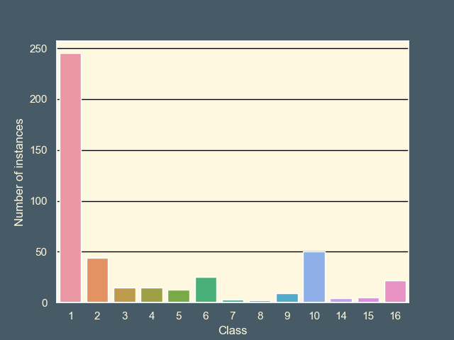
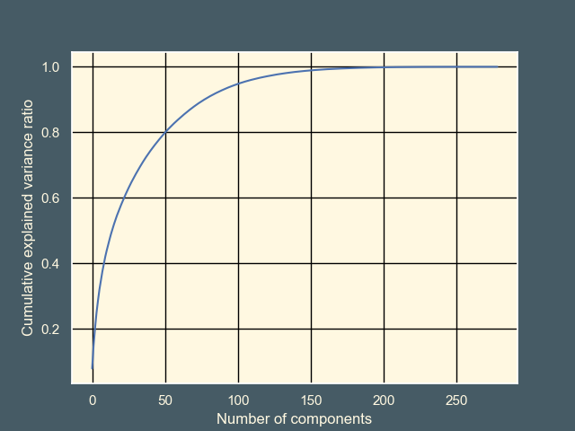

---

marp: true
theme: gaia
class: invert
paginate: false
style: |
  .columns {
    display: grid;
    grid-template-columns: repeat(2, minmax(0, 1fr));
    gap: 1rem;
  }

---

# Detection / classification of arrhythmia
<span style="color:lightgrey">By:</span> Martin Dahl Sørensen

---
<style scoped>section { font-size: 20px; }.columns{font-size: 15px;} </style>

|  |  |  |  |  |  |
|---|---|---|---|---|---|
| Data Set Characteristics:   | Multivariate | Number of Instances: | 452 | Area: | Life |
| Attribute Characteristics: | Categorical, Integer, Real | Number of Attributes: | 279 | Date Donated | 1998-01-01 |
| Associated Tasks: | Classification | Missing Values? | Yes | Number of Web Hits: | 418004 |

<div class ="columns">
<div>



</div>
<div>
&nbsp;

1. Normal
2. Ischemic changes (Coronary Artery Disease)
3. Old Anterior Myocardial Infarction
4. Old Inferior Myocardial Infarction
5. Sinus tachycardy
6. Sinus bradycardy
7. Ventricular Premature Contraction (PVC)
8. Supraventricular Premature Contraction
9. Left bundle branch block
10. Right bundle branch block
11. 1\. degree AtrioVentricular block	
12. 2\. degree AV block
13. 3\. degree AV block
14. Left ventricule hypertrophy
15. Atrial Fibrillation or Flutter
16. Others

</div>
</div>

<!-- 
The data set I've worked with is the arrhythmia Data Set.

The goal of this dataset, as described on the Machine Learning Repository, is to distinguish between the presence and absence of cardiac arrhythmia and classify it in one of the 16 groups.

There are 279 attributes with 452 instances where some may contain missing attributes. these missing values are denoted with a question mark
-->

---
#  Importing the data 
```python
def GetData():
    url = 'https://archive.ics.uci.edu/ml/machine-learning-databases/arrhythmia/arrhythmia.data'
    df = pd.read_csv(url, header=None, na_values='?')
    df.columns = [line.rstrip() for line in open('mlarrhythmia_dataaddons/arrhythmia.headers')]
    classes = [line.rstrip() for line in open('mlarrhythmia_dataaddons/arrhythmia.classes')]
    return classes, df
```
```
              Age         Sex      Height      Weight  QRS duration  P-R interval  ...  V6 S' wave   V6 P wave   V6 T wave     V6 QRSA    V6 QRSTA       Class
count  452.000000  452.000000  452.000000  452.000000    452.000000    452.000000  ...       452.0  452.000000  452.000000  452.000000  452.000000  452.000000
mean    46.471239    0.550885  166.188053   68.170354     88.920354    155.152655  ...         0.0    0.514823    1.222345   19.326106   29.473230    3.880531
std     16.466631    0.497955   37.170340   16.590803     15.364394     44.842283  ...         0.0    0.347531    1.426052   13.503922   18.493927    4.407097
min      0.000000    0.000000  105.000000    6.000000     55.000000      0.000000  ...         0.0   -0.800000   -6.000000  -44.200000  -38.600000    1.000000
25%     36.000000    0.000000  160.000000   59.000000     80.000000    142.000000  ...         0.0    0.400000    0.500000   11.450000   17.550000    1.000000
50%     47.000000    1.000000  164.000000   68.000000     86.000000    157.000000  ...         0.0    0.500000    1.350000   18.100000   27.900000    1.000000
75%     58.000000    1.000000  170.000000   79.000000     94.000000    175.000000  ...         0.0    0.700000    2.100000   25.825000   41.125000    6.000000
max     83.000000    1.000000  780.000000  176.000000    188.000000    524.000000  ...         0.0    2.400000    6.000000   88.800000  115.900000   16.000000
```
<!--
Importing the data is easy with pandas. 
For added convenience I have local list of attributes names I add to the DataFrame as headers.
And I supply a list of the class names as an array in the get method.

Then using the describe method on the DataFrame it shows me a distribution of the first five and the last four attributes, as the last column is the labels.

There are a lot of attributes and I have no idea what any of them mean except for the first four.
I could try and plot some of the attributes to see if there any clear distinction between classes, but since there are so many of them I don't think it makes sense to try and manually figure out which attributes have the most influence. 
-->
---
# Cleaning the data


```python
_, df =  GetData()
mask = df.isnull()
missing = mask.sum()
percent_missing = missing / len(df)
percent_missing_nonzero = percent_missing[percent_missing > 0]
print(percent_missing_nonzero)
```

<div class ="columns">
<div>

```
T             0.017699
P             0.048673
QRST          0.002212
J             0.831858
Heart rate    0.002212
```
</div>
<div>

```py
def GetDataClean():
    classes, df = GetData()
    df = df.drop('J', axis=1)
    df = df.fillna(df.median())
    return classes, df
```
</div>
</div>

<!--
As you can see 5 of the attributes contain missing data with J being the worst as 83% of its data is missing. for this reason I'm gonna drop this column from the data set, and for the rest I'm going to replace it by their respective median value as median is less susceptible to outliers.
-->

---
# Principal Component Analysis (PCA)

<div class ="columns">
<div>

95% - 102 axes
99% - 153 axes



</div>
<div>

```python
def GetDataPCA(rv = 0):
    #Get the data and fix missing values
    classes, df = GetDataClean()
    data = df.drop("Class", axis=1)

    #Scale the data
    scaler = StandardScaler()
    data_scaled = scaler.fit_transform(data)

    #PCA the data
    if (rv == 0):
        pca = PCA()
    else:
        pca = PCA(rv)
    pca.fit(data_scaled)

    data_transformed = pca.transform(data_scaled)
    df_transformed = pd.concat([pd.DataFrame(data_transformed), 
    pd.DataFrame(df["Class"], columns=['Class'])],axis=1) 

    return classes, pca, df_transformed
```
```python
print(len(GetDataPCA(0.95)[0].explained_variance_ratio_))
print(len(GetDataPCA(0.99)[0].explained_variance_ratio_))
```

</div>
</div>

<!--
A way to reduce dimensionality of the data is with Principal Component Analysis. The main goal of PCA is to reframe the data to make it easier to separate things out and cluster things, and as a result the resulting axes are also ordered from the most to least useful, and with this we can then reduce the dimensionality by discarding the maybe not so important axes.

Before applying PCA it is a must to standardize the data, so all of the attributes are centered around zero and have a standard deviation of one. This is because PCA is sensitive to the scale of the features, and features on larger scales can dominate the result.

By taking the cumulative explained variance and plotting we can se that the first 103 axes explain 95% of the data with 154 explaining 99% this means we can drop almost half the number of axes and only loose 1% of the explained variance
-->
---
# Unsupervised Learning with Clustering Algorithms

<!--
KMeans is an unsupervised learning algorithm that divides a set of data points into clusters based on the similarity of their features. It does this by trying to minimize the sum of the distances between the data points and the centroids (i.e., the center points) of the clusters.
-->
---
# Supervised Learning with Support Vector Machines

<!--
SVMs, on the other hand, are a type of linear model that can be used for classification and regression tasks. They work by finding the hyperplane in a high-dimensional space that maximally separates the different classes. In the case of classification tasks, the goal is to find the hyperplane that maximally separates the different classes, while in the case of regression tasks, the goal is to find the hyperplane that best fits the data.
-->

---
# Machine learning with a Convolutional Neural Networks

<!--

-->
---
# Conclusion

<!--
I aint no data sientist
-->